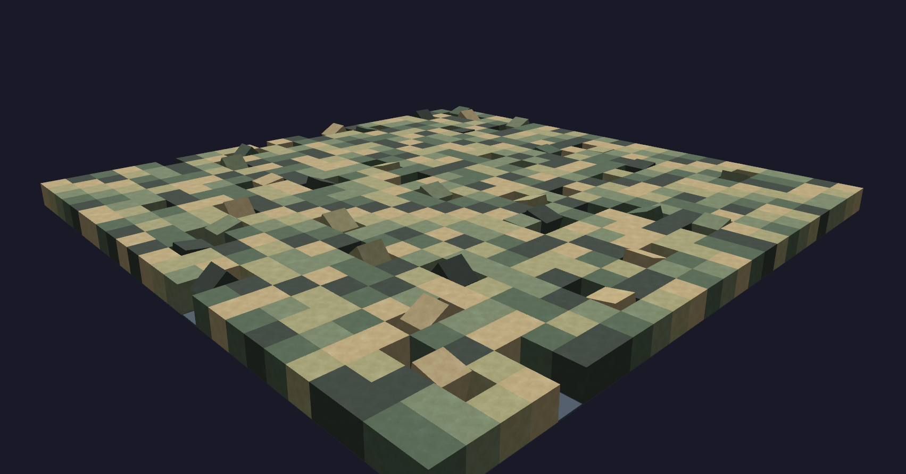

# Three.js Playground

A place where I test out ThreeJS Ideas.

Here are some cubes that walk aroud each other:

Screenshot:


## Quick Start

```bash
npm install
npm run dev
```

Open http://localhost:5173/

## Build

```bash
npm run build
npm run preview
```
